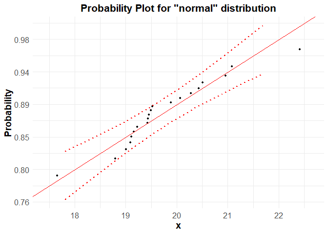

# r6qualitytools

<!-- badges: start -->
<!-- [](https://CRAN.R-project.org/package=r6qualitytools) -->

[](https://app.codecov.io/gh/Fabianenc/r6qualitytools?branch=main)
[](https://github.com/Fabianenc/r6qualitytools/actions/workflows/R-CMD-check.yaml)

<!-- badges: end -->

The goal of **r6qualitytools** is to provide a comprehensive suite of
statistical tools for Quality Management, designed around the Define,
Measure, Analyze, Improve, and Control (DMAIC) cycle used in Six Sigma
methodology. It builds on the original discontinued CRAN package
**qualitytools**, enhancing it with R6 object-oriented programming,
modernizing the graphics with **ggplot2** and **plotly**, and adopting
**tidyverse** principles for data manipulation and visualization.

## Installation

``` r
install.packages("r6qualitytools")
library("r6qualitytools")
```

## Overview

**r6qualitytools** includes various tools to manage quality science
processes efficiently:

- **DMAIC methodology**: tools designed around the Six Sigma cycle.
- **R6-based design**: uses R6 classes for flexibility and performance.
- **Interactive graphics**: modern visualizations with **ggplot2** and
  **plotly**.
- **tidyverse integration**: easy data manipulation and visualization.

It supports a variety of analyses relevant to quality management,
offering an intuitive interface for both beginners and advanced users.

For more details, see the package documentation.

## Usage

You can use the package to generate statistical models and control
charts efficiently. Here are basic examples that demonstrates the use of
the package:

``` r
library(r6qualitytools)

# Object of Class Distr - Normal
set.seed(123)
data <- rnorm(100, mean = 5, sd = 2)
parameters <- list(mean = 5, sd = 2)
distr <- Distr$new(x = data, name = "normal", parameters = parameters, sd = 2, n = 100, loglik = -120)
distr$plot()
```


``` r
# Class DistrCollection
data2 <- rpois(100, lambda = 3)
parameters2 <- list(lambda = 3)
distr2 <- Distr$new(x = data2, name = "poisson", parameters = parameters2, sd = sqrt(3), n = 100, loglik = -150)
distr2$plot()
```


``` r

collection <- DistrCollection$new()
collection$add(distr)
collection$add(distr2)
collection$summary()
#> 
#> ------ Fitted Distribution and estimated parameters ------
#> 
#> fitted distribution is normal :
#> $mean
#> [1] 5
#> 
#> $sd
#> [1] 2
#> 
#> 
#> fitted distribution is poisson :
#> $lambda
#> [1] 3
#> 
#> 
#> 
#> ------ Goodness of Fit - Anderson Darling Test ------
#> 
#>   Distribution     A p.value
#> 1       normal 0.182  0.9104
#> 2      poisson 5.733      NA
```

``` r
# qqPlot and ppPlot
set.seed(1234)
x <- rnorm(20, mean = 20)
qqPlot(x, "normal", bounds.lty = 3, bounds.col = "red")
```


``` r
ppPlot(x, "normal", bounds.lty = 3, bounds.col = "red")
```



``` r
# Gage capacity
x <- c( 9.991, 10.013, 10.001, 10.007, 10.010, 10.013, 10.008, 10.017, 10.005, 10.005, 10.002,
        10.017, 10.005, 10.002, 9.996, 10.011, 10.009 , 10.006, 10.008, 10.003, 10.002, 10.006, 
        10.010, 9.992, 10.013)

cg(x, target = 10.003, tolerance = c(9.903, 10.103))
```


``` r
# Process Capability
set.seed(1234)
data <- rnorm(20, mean = 20)
pcr(data, "normal", lsl = 17, usl = 23)
#> Scale for x is already present.
#> Adding another scale for x, which will replace the existing scale.
#> 
#>  Anderson Darling Test for normal distribution
#> 
#> data:  data 
#> A = 0.5722, mean = 19.749, sd = 1.014, p-value = 0.1191
#> alternative hypothesis: true distribution is not equal to normal
```


``` r
# Gage R&R Design
gdo <- gageRRDesign(Operators = 3, Parts = 10, Measurements = 3, randomize = FALSE, method='nested')
# vector of responses
y <- c(0.29,0.08, 0.04,-0.56,-0.47,-1.38,1.34,1.19,0.88,0.47,0.01,0.14,-0.80,
      -0.56,-1.46, 0.02,-0.20,-0.29,0.59,0.47,0.02,-0.31,-0.63,-0.46,2.26,
      1.80,1.77,-1.36,-1.68,-1.49,0.41,0.25,-0.11,-0.68,-1.22,-1.13,1.17,0.94,
      1.09,0.50,1.03,0.20,-0.92,-1.20,-1.07,-0.11, 0.22,-0.67,0.75,0.55,0.01,
      -0.20, 0.08,-0.56,1.99,2.12,1.45,-1.25,-1.62,-1.77,0.64,0.07,-0.15,-0.58,
      -0.68,-0.96,1.27,1.34,0.67,0.64,0.20,0.11,-0.84,-1.28,-1.45,-0.21,0.06,
      -0.49,0.66,0.83,0.21,-0.17,-0.34,-0.49,2.01,2.19,1.87,-1.31,-1.50,-2.16)
gdo$response(y)

gdo <- gageRR(gdo, method='nested')
#> 
#> AnOVa Table -  nested Design
#>               Df Sum Sq Mean Sq F value Pr(>F)    
#> Operator       2   0.01   0.003   0.029  0.972    
#> Operator:Part 27  89.03   3.298  35.283 <2e-16 ***
#> Residuals     60   5.61   0.093                   
#> ---
#> Signif. codes:  0 '***' 0.001 '**' 0.01 '*' 0.05 '.' 0.1 ' ' 1
#> 
#> ----------
#> 
#> Gage R&R
#>                  VarComp VarCompContrib Stdev StudyVar StudyVarContrib
#> totalRR           0.0935         0.0805 0.306     1.83           0.284
#>  repeatability    0.0935         0.0805 0.306     1.83           0.284
#>  reproducibility  0.0000         0.0000 0.000     0.00           0.000
#> Part to Part      1.0680         0.9195 1.033     6.20           0.959
#> totalVar          1.1615         1.0000 1.078     6.47           1.000
#> 
#> ---
#>  * Contrib equals Contribution in %
#>  **Number of Distinct Categories (truncated signal-to-noise-ratio) = 4

# Using Plots
gdo$errorPlot()
```


``` r
gdo$whiskersPlot()
```


``` r
gdo$averagePlot()
```


``` r
gdo$compPlot()
```


``` r
# Factorial Designs
vp.full <- facDesign(k = 3)
y = rnorm(2^3)
vp.full$.response(y)
vp.full$summary()
#> Information about the factors:
#> 
#>            A       B       C
#> low       -1      -1      -1
#> high       1       1       1
#> name       A       B       C
#> unit                        
#> type numeric numeric numeric
#> -----------
#>   StandOrder RunOrder Block  A  B  C           y
#> 7          7        1     1 -1  1  1  0.03572991
#> 2          2        2     1  1 -1 -1  0.11297506
#> 6          6        3     1  1 -1  1  1.42855203
#> 1          1        4     1 -1 -1 -1  0.98340378
#> 4          4        5     1  1  1 -1 -0.62245679
#> 3          3        6     1 -1  1 -1 -0.73153600
#> 8          8        7     1  1  1  1 -0.51666972
#> 5          5        8     1 -1 -1  1 -1.75073344
vp.full$effectPlot()
```


``` r

# Plots
paretoPlot(vp.full, p.col = "Pastel1")
#> Scale for y is already present.
#> Adding another scale for y, which will replace the existing scale.
```


``` r
normalPlot(vp.full)
```


``` r
wire1 <- wirePlot(A,B,y, data = vp.full)
wire1$plot
```


``` r
contour1 <- contourPlot(A,B,y, data = vp.full)
contour1$plot
```


``` r
# Mix Design
mdo <- mixDesign(3, 2, center = FALSE, axial = FALSE, randomize = FALSE, replicates = c(1, 1, 2, 3))

mdo$names(c("polyethylene", "polystyrene", "polypropylene"))
elongation <- c(11.0, 12.4, 15.0, 14.8, 16.1, 17.7, 16.4, 16.6, 8.8, 10.0, 10.0, 9.7, 11.8, 16.8, 16.0)
mdo$.response(elongation)
mdo$summary()
#> Simplex LATTICE Design
#> Information about the factors:
#> 
#>      polyethylene polystyrene polypropylene
#> low             0           0             0
#> high            1           1             1
#> name polyethylene polystyrene polypropylene
#> unit            %           %             %
#> type      numeric     numeric       numeric
#> 
#> -----------
#> 
#> Information about the Design Points:
#> 
#>            1-blend 2-blend
#> Unique           3       3
#> Replicates       2       3
#> Sub Total        6       9
#> Total           15        
#> 
#> -----------
#> 
#> Information about the constraints:
#> 
#> A >= 0 B >= 0 C >= 0
#> 
#> -----------
#> 
#>                               PseudoComponent _|_ Proportion _|_ Amount
#> 
#>    StandOrder RunOrder    Type |   A   B   C _ | _   A   B   C _ | _   A   B
#> 1           1        1 1-blend | 1.0 0.0 0.0   |   1.0 0.0 0.0   |   1.0 0.0
#> 2           2        2 1-blend | 1.0 0.0 0.0   |   1.0 0.0 0.0   |   1.0 0.0
#> 3           3        3 2-blend | 0.5 0.5 0.0   |   0.5 0.5 0.0   |   0.5 0.5
#> 4           4        4 2-blend | 0.5 0.5 0.0   |   0.5 0.5 0.0   |   0.5 0.5
#> 5           5        5 2-blend | 0.5 0.5 0.0   |   0.5 0.5 0.0   |   0.5 0.5
#> 6           6        6 2-blend | 0.5 0.0 0.5   |   0.5 0.0 0.5   |   0.5 0.0
#> 7           7        7 2-blend | 0.5 0.0 0.5   |   0.5 0.0 0.5   |   0.5 0.0
#> 8           8        8 2-blend | 0.5 0.0 0.5   |   0.5 0.0 0.5   |   0.5 0.0
#> 9           9        9 1-blend | 0.0 1.0 0.0   |   0.0 1.0 0.0   |   0.0 1.0
#> 10         10       10 1-blend | 0.0 1.0 0.0   |   0.0 1.0 0.0   |   0.0 1.0
#> 11         11       11 2-blend | 0.0 0.5 0.5   |   0.0 0.5 0.5   |   0.0 0.5
#> 12         12       12 2-blend | 0.0 0.5 0.5   |   0.0 0.5 0.5   |   0.0 0.5
#> 13         13       13 2-blend | 0.0 0.5 0.5   |   0.0 0.5 0.5   |   0.0 0.5
#> 14         14       14 1-blend | 0.0 0.0 1.0   |   0.0 0.0 1.0   |   0.0 0.0
#> 15         15       15 1-blend | 0.0 0.0 1.0   |   0.0 0.0 1.0   |   0.0 0.0
#>      C | elongation
#> 1  0.0 |       11.0
#> 2  0.0 |       12.4
#> 3  0.0 |       15.0
#> 4  0.0 |       14.8
#> 5  0.0 |       16.1
#> 6  0.5 |       17.7
#> 7  0.5 |       16.4
#> 8  0.5 |       16.6
#> 9  0.0 |        8.8
#> 10 0.0 |       10.0
#> 11 0.5 |       10.0
#> 12 0.5 |        9.7
#> 13 0.5 |       11.8
#> 14 1.0 |       16.8
#> 15 1.0 |       16.0
#> 
#> -----------
#> 
#> Mixture Total: 1 equals 1

contour3 <- contourPlot3(A, B, C, elongation, data = mdo, form = "quadratic")
contour3$plot
```


``` r
wire3 <- wirePlot3(A, B, C, elongation, data = mdo, form = "quadratic")
wire3$plot
```


``` r
# Taguchi Design
tdo <- taguchiDesign("L9_3",randomize=F)
tdo$values(list(A = c("material 1", "material 2", "material 3"), B = c(29, 30, 35)))
tdo$names(c("Factor 1", "Factor 2", "Factor 3", "Factor 4"))
set.seed(1)
tdo$.response(rnorm(9))
tdo$summary()
#> Taguchi SINGLE Design
#> Information about the factors:
#> 
#>                  A        B        C        D
#> value 1 material 1       29        1        1
#> value 2 material 2       30        2        2
#> value 3 material 3       35        3        3
#> name      Factor 1 Factor 2 Factor 3 Factor 4
#> unit                                         
#> type       numeric  numeric  numeric  numeric
#> 
#> -----------
#> 
#>   StandOrder RunOrder Replicate A B C D   rnorm(9)
#> 1          1        1         1 1 1 1 1 -0.6264538
#> 2          2        2         1 1 2 2 2  0.1836433
#> 3          3        3         1 1 3 3 3 -0.8356286
#> 4          4        4         1 2 1 2 3  1.5952808
#> 5          5        5         1 2 2 3 1  0.3295078
#> 6          6        6         1 2 3 1 2 -0.8204684
#> 7          7        7         1 3 1 3 2  0.4874291
#> 8          8        8         1 3 2 1 3  0.7383247
#> 9          9        9         1 3 3 2 1  0.5757814
#> 
#> -----------
tdo$effectPlot()
```


``` r
# Plackett-Burman Design
pbdo<- pbDesign(26)
pbdo$summary()
#> Plackett-Burman  Design
#> Information about the factors:
#> 
#>               A       B       C       D       E       F       G       H       J
#> value 1      -1      -1      -1      -1      -1      -1      -1      -1      -1
#> value 2       1       1       1       1       1       1       1       1       1
#> name                                                                           
#> unit                                                                           
#> type    numeric numeric numeric numeric numeric numeric numeric numeric numeric
#>               K       L       M       N       O       P       Q       R       S
#> value 1      -1      -1      -1      -1      -1      -1      -1      -1      -1
#> value 2       1       1       1       1       1       1       1       1       1
#> name                                                                           
#> unit                                                                           
#> type    numeric numeric numeric numeric numeric numeric numeric numeric numeric
#>               T       U       V       W       X       Y       Z
#> value 1      -1      -1      -1      -1      -1      -1      -1
#> value 2       1       1       1       1       1       1       1
#> name                                                           
#> unit                                                           
#> type    numeric numeric numeric numeric numeric numeric numeric
#> 
#> -----------
#> 
#>    StandOrder RunOrder Replicate  A  B  C  D  E  F  G  H  J  K  L  M  N  O  P
#> 1          16        1         1  1 -1  1  1 -1 -1 -1  1  1  1  1  1 -1 -1  1
#> 2          11        2         1 -1 -1  1  1  1  1  1 -1 -1  1 -1 -1 -1 -1  1
#> 3          18        3         1  1  1  1 -1  1  1 -1 -1 -1  1  1  1  1  1 -1
#> 4          17        4         1  1  1 -1  1  1 -1 -1 -1  1  1  1  1  1 -1 -1
#> 5           6        5         1  1  1 -1 -1  1 -1 -1 -1 -1  1 -1  1 -1  1  1
#> 6          19        6         1 -1  1  1  1 -1  1  1 -1 -1 -1  1  1  1  1  1
#> 7           2        7         1  1 -1 -1 -1 -1  1 -1  1 -1  1  1  1 -1  1  1
#> 8          24        8         1 -1 -1  1 -1  1 -1  1  1  1 -1  1  1 -1 -1 -1
#> 9           3        9         1 -1  1 -1 -1 -1 -1  1 -1  1 -1  1  1  1 -1  1
#> 10          1       10         1 -1 -1 -1 -1  1 -1  1 -1  1  1  1 -1  1  1 -1
#> 11         26       11         1 -1 -1 -1 -1 -1 -1 -1 -1 -1 -1 -1 -1 -1 -1 -1
#> 12         15       12         1 -1  1  1 -1 -1 -1  1  1  1  1  1 -1 -1  1 -1
#> 13         25       13         1 -1 -1 -1  1 -1  1 -1  1  1  1 -1  1  1 -1 -1
#> 14          8       14         1  1  1  1  1 -1 -1  1 -1 -1 -1 -1  1 -1  1 -1
#> 15          4       15         1 -1 -1  1 -1 -1 -1 -1  1 -1  1 -1  1  1  1 -1
#> 16         20       16         1  1 -1  1  1  1 -1  1  1 -1 -1 -1  1  1  1  1
#> 17         23       17         1 -1  1 -1  1 -1  1  1  1 -1  1  1 -1 -1 -1  1
#> 18         10       18         1 -1  1  1  1  1  1 -1 -1  1 -1 -1 -1 -1  1 -1
#> 19         13       19         1  1 -1 -1 -1  1  1  1  1  1 -1 -1  1 -1 -1 -1
#> 20         14       20         1  1  1 -1 -1 -1  1  1  1  1  1 -1 -1  1 -1 -1
#> 21          5       21         1  1 -1 -1  1 -1 -1 -1 -1  1 -1  1 -1  1  1  1
#> 22          9       22         1  1  1  1  1  1 -1 -1  1 -1 -1 -1 -1  1 -1  1
#> 23         22       23         1  1 -1  1 -1  1  1  1 -1  1  1 -1 -1 -1  1  1
#> 24          7       24         1  1  1  1 -1 -1  1 -1 -1 -1 -1  1 -1  1 -1  1
#> 25         21       25         1 -1  1 -1  1  1  1 -1  1  1 -1 -1 -1  1  1  1
#> 26         12       26         1 -1 -1 -1  1  1  1  1  1 -1 -1  1 -1 -1 -1 -1
#>     Q  R  S  T  U  V  W  X  Y  Z  y
#> 1  -1 -1 -1 -1  1 -1  1 -1  1  1 NA
#> 2  -1  1 -1  1  1  1 -1  1  1 -1 NA
#> 3  -1  1 -1 -1 -1 -1  1 -1  1 -1 NA
#> 4   1 -1 -1 -1 -1  1 -1  1 -1  1 NA
#> 5   1 -1  1  1 -1 -1 -1  1  1  1 NA
#> 6  -1 -1  1 -1 -1 -1 -1  1 -1  1 NA
#> 7  -1 -1 -1  1  1  1  1  1 -1 -1 NA
#> 8   1  1  1  1  1 -1 -1  1 -1 -1 NA
#> 9   1 -1 -1 -1  1  1  1  1  1 -1 NA
#> 10 -1 -1  1  1  1  1  1 -1 -1  1 NA
#> 11 -1 -1 -1 -1 -1 -1 -1 -1 -1 -1 NA
#> 12 -1 -1 -1  1 -1  1 -1  1  1  1 NA
#> 13 -1  1  1  1  1  1 -1 -1  1 -1 NA
#> 14  1  1  1 -1  1  1 -1 -1 -1  1 NA
#> 15  1  1 -1 -1 -1  1  1  1  1  1 NA
#> 16  1 -1 -1  1 -1 -1 -1 -1  1 -1 NA
#> 17  1  1  1  1 -1 -1  1 -1 -1 -1 NA
#> 18  1 -1  1  1  1 -1  1  1 -1 -1 NA
#> 19 -1  1 -1  1 -1  1  1  1 -1  1 NA
#> 20 -1 -1  1 -1  1 -1  1  1  1 -1 NA
#> 21 -1  1  1 -1 -1 -1  1  1  1  1 NA
#> 22 -1  1  1  1 -1  1  1 -1 -1 -1 NA
#> 23  1  1  1 -1 -1  1 -1 -1 -1 -1 NA
#> 24  1  1 -1  1  1 -1 -1 -1  1  1 NA
#> 25  1  1 -1 -1  1 -1 -1 -1 -1  1 NA
#> 26  1 -1  1 -1  1  1  1 -1  1  1 NA
#> 
#> -----------
```

``` r
# gageLin Design
A=c(2.7,2.5,2.4,2.5,2.7,2.3,2.5,2.5,2.4,2.4,2.6,2.4)
B=c(5.1,3.9,4.2,5,3.8,3.9,3.9,3.9,3.9,4,4.1,3.8)
C=c(5.8,5.7,5.9,5.9,6,6.1,6,6.1,6.4,6.3,6,6.1)
D=c(7.6,7.7,7.8,7.7,7.8,7.8,7.8,7.7,7.8,7.5,7.6,7.7)
E=c(9.1,9.3,9.5,9.3,9.4,9.5,9.5,9.5,9.6,9.2,9.3,9.4)

test=gageLinDesign(ref=c(2,4,6,8,10),n=12)
Messungen=data.frame(rbind(A,B,C,D,E))
test$response(Messungen)
test$summary()
#> ----------------------
#>   Part Ref  X1  X2  X3  X4  X5  X6  X7  X8  X9 X10 X11 X12
#> A    1   2 2.7 2.5 2.4 2.5 2.7 2.3 2.5 2.5 2.4 2.4 2.6 2.4
#> B    2   4 5.1 3.9 4.2 5.0 3.8 3.9 3.9 3.9 3.9 4.0 4.1 3.8
#> C    3   6 5.8 5.7 5.9 5.9 6.0 6.1 6.0 6.1 6.4 6.3 6.0 6.1
#> D    4   8 7.6 7.7 7.8 7.7 7.8 7.8 7.8 7.7 7.8 7.5 7.6 7.7
#> E    5  10 9.1 9.3 9.5 9.3 9.4 9.5 9.5 9.5 9.6 9.2 9.3 9.4
#> ----------------------

MSALin=gageLin(test,lty=c(3,4), plot = FALSE)
#> ----------------------
#> BIAS:
#>     X1   X2   X3   X4   X5   X6   X7   X8   X9  X10  X11  X12
#> A  0.7  0.5  0.4  0.5  0.7  0.3  0.5  0.5  0.4  0.4  0.6  0.4
#> B  1.1 -0.1  0.2  1.0 -0.2 -0.1 -0.1 -0.1 -0.1  0.0  0.1 -0.2
#> C -0.2 -0.3 -0.1 -0.1  0.0  0.1  0.0  0.1  0.4  0.3  0.0  0.1
#> D -0.4 -0.3 -0.2 -0.3 -0.2 -0.2 -0.2 -0.3 -0.2 -0.5 -0.4 -0.3
#> E -0.9 -0.7 -0.5 -0.7 -0.6 -0.5 -0.5 -0.5 -0.4 -0.8 -0.7 -0.6
#> ----------------------
#> MEAN OF BIAS:
#>          A          B          C          D          E 
#>  0.4916667  0.1250000  0.0250000 -0.2916667 -0.6166667 
#> ----------------------
#> LINEAR MODEL:
#> 
#> Call:
#> lm(formula = BIAS ~ ref)
#> 
#> Residuals:
#>      Min       1Q   Median       3Q      Max 
#> -0.41000 -0.12000  0.01667  0.11667  0.89000 
#> 
#> Coefficients:
#>             Estimate Std. Error t value Pr(>|t|)    
#> (Intercept)  0.73667    0.07252   10.16 1.73e-14 ***
#> ref         -0.13167    0.01093  -12.04  < 2e-16 ***
#> ---
#> Signif. codes:  0 '***' 0.001 '**' 0.01 '*' 0.05 '.' 0.1 ' ' 1
#> 
#> Residual standard error: 0.2395 on 58 degrees of freedom
#> Multiple R-squared:  0.7143, Adjusted R-squared:  0.7094 
#> F-statistic:   145 on 1 and 58 DF,  p-value: < 2.2e-16
#> 
#> ----------------------
#> LINEARITY: 
#>   13.16667
MSALin$plot()
```


## Getting help

If you encounter any issues or have questions, please file an issue with
a reproducible example at the [GitHub
repo](https://github.com/Fabianenc/r6qualitytools/issues).
